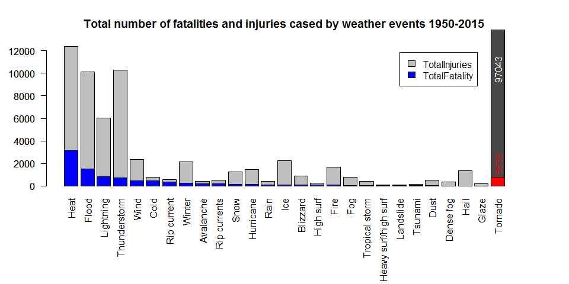
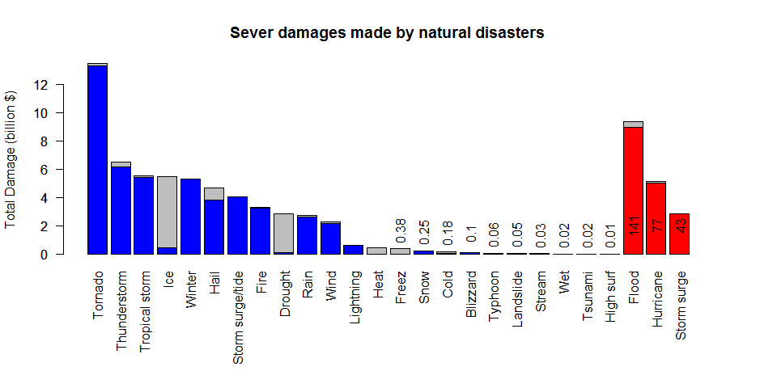

Synopsis
========

Storms and other sever weather events can cause health and economic
problems. In this report I explore the U.S. National Oceanic and
Atmospheric Administration's (NOAA) storm database in order to find
weather disasters whit the most health and economic problems.

The results show that Tornado made the most both human fatalities and
total fatality and injuries with more than 5600 fatalities and 90
thousand injuries from 1950 to today. After that with a big gap comes
severe heat with more than 3000 death and around 10 thousand injuries.

In the sense of economic consequences, the worse event is flood with
more than 140 billion dollars following by Hurricane with 77 and Storm
surge with 42 billion dollars.

Data Proccesing
===============

The NOAA storm database contains a variety of information about
individual weather disasters including their time and place of
occurrence, property damage, number of death and injuries, etc.

To run this report you need to have an internet connection at least for
the first time you run it. Please be patient the first run is quite time
consuming.

The analysis is done in two steps.

-- Downloading and loading the data.

-- Summarizing and tiding up the data.

### Downloading and loading the data

The data will be downloaded directly from the web (if not already in the
data folder under the working directory) and loaded into R. This step is
quite time consuming due to volume of the data and will be cashed for
the sake of efficiency.

    if (!dir.exists("data")) dir.create("data")
    if (!file.exists("./data/Storm-Data.csv.bz2")) {
            download.file("https://d396qusza40orc.cloudfront.net/repdata%2Fdata%2FStormData.csv.bz2",
                          destfile = "./data/Storm-Data.csv.bz2")
    }
    storms <- read.csv("./data/Storm-Data.csv.bz2")

### Summerizing the data

The data set contains some columns which are the most important for us.
"EVTYPE", the type of the event, "FATALITIES", number of fatalities,
"INJURIES" number of injuries, "PROPDMG", "PROPDMGEXP", "CROPDMG" and
"CROPDMGEXP", receptively short version numbers of property and cropland
damages and the corresponding exponents (for instance 5 "PROPDMG" with
"PROPDMGEXP" of "M" means 5 million dollars property damage).

To have the actual damage first this units needs to be converted to
numbers. Unfortunately there is no proper explanation of the units in
the documentation, but searching in the web I could conclude that the
conversion table is as follows which I saved them in a variable named
'convert'.

    convert <- data.frame(exp = c(as.character(levels(storms$PROPDMGEXP)),"k"), value = c(0,0,0,10,10,10,10,10,10,10,10,10,10,1000000000,100,100,1000,1000000,100000, 1000))

    ##    exp value
    ## 1      0e+00
    ## 2    - 0e+00
    ## 3    ? 0e+00
    ## 4    + 1e+01
    ## 5    0 1e+01
    ## 6    1 1e+01
    ## 7    2 1e+01
    ## 8    3 1e+01
    ## 9    4 1e+01
    ## 10   5 1e+01
    ## 11   6 1e+01
    ## 12   7 1e+01
    ## 13   8 1e+01
    ## 14   B 1e+09
    ## 15   h 1e+02
    ## 16   H 1e+02
    ## 17   K 1e+03
    ## 18   m 1e+06
    ## 19   M 1e+05
    ## 20   k 1e+03

To convert these units (exponents) to numbers I write a function named
"relable" which takes the exponents column and the converting table and
output a vector of numbers corresponding to the input exponents.

    relable <- function(oldfactor, convert){
            newvalue <- as.character(oldfactor)
            for (i in unique(newvalue)){
                    newvalue[newvalue == i] <- convert$value[convert$exp == i]
            }
            as.numeric(newvalue)
    }

Using the "relable" function I produce two vectors corresponding to the
property and cropland expenses of the events in the data set.

    propexp <- relable(storms$PROPDMGEXP, convert)
    cropexp <- relable(storms$CROPDMGEXP, convert)

Using these two vectors I computed the actual property, cropland and
total damage of each event.

    library(plyr)
    library(dplyr)
    library(data.table)
    storms <- as.data.table(storms)
    storms[, PropDamage := propexp * PROPDMG]
    storms[, CropDamage := cropexp * CROPDMG]
    storms[, TotalDamage := PropDamage + CropDamage]

Then I subset the data set to events which actually made human or
economic problems and summarized the data based on the total damage,
fatality and injuries made by each event type.

    #storm with positive damage ...
    harmfullStorms <- storms[TotalDamage > 0 | FATALITIES > 0 | INJURIES > 0,]
    #summerize
    DamageType <- ddply(harmfullStorms, .(EVTYPE), summarise, 
                        TotalDamage = sum(TotalDamage), 
                        PropDamage = sum(PropDamage),
                        CropDamage = sum(CropDamage),
                        TotalFatality = sum(FATALITIES),
                        TotalInjuries = sum(INJURIES))

Summarizing is not finished yet. There are lots of duplicates in the
data set. Lots of similar event types are stored separately due to
different spelling, spacing and using special characters. plus some
events are saved too detailed. First of all I noted that TORNADO once
was misspelled as TORNAO and corrected it.

    DamageType[DamageType$EVTYPE == "TORNAO", 1] <- "TORNADO"

To have more neat data set, I wrote a function which gets a word and the
summarized data set and summarize merge the events which have that word
in their EVETYPE.

    sumduplicate <- function(pattern, expensetable){
           index <- grep(tolower(pattern), tolower(expensetable[,1]))
           sum <- apply(expensetable[index,-1],2,sum)
           new <- data.frame(pattern, t(sum))
           names(new) <- names(expensetable)
           rbind(expensetable[-index,],new)
    }

Exploring the data set I concluded that one should merge the rows
containing the following words together.

    namelist <- c("Flood", "Thunderstorm", "TSTM", "Rain", "Tornado", "Fire", "Squall", "Freez", "Hurricane", "Ice", "Hail", "waterspout", "Heat", "Glaze", "precipitation", "microburst", "Wet", "winter", "Cold", "Tsunami", "Snow", "Stream", "Lightning", "Dust", "Wintry Mix", "Urban", "Wind")

And ran this list of words in the "sumdupliacte" function mentioned
above. Making a much more compact data set.

    for ( x in namelist){
           DamageType <- sumduplicate(x, expensetable = DamageType)
    }

I also noted that Thunderstorm sometimes where called TSTM, so I merged
the two occurrences.

    #Thunderstorm and TSTM are the same
    index <- which(DamageType$EVTYPE ==  "Thunderstorm" |
                   DamageType$EVTYPE == "TSTM")
    sum <- apply(DamageType[index,-1],2,sum)
    new <- data.frame("Thunderstorm", t(sum))
    names(new) <- names(DamageType)
    DamageType <- rbind(DamageType[-index,], new)

The data is acceptably summarized. As the last step, I capitalized the
first letter of the event types names to be shown more nicely in the
plots.

    library(Hmisc)
    DamageType$EVTYPE <- capitalize(tolower(DamageType$EVTYPE))

Results
=======

In this section we answer the main questions of the analysis i.e.
finding the most harmful weather events to human health and economy and
show the results in plots.

#### Fatalities and injuries

To have a understandable diagram I summarized the data by the events
having at least 30 fatalities or 100 injuries.

    #plot injuries and fatalities
    FatInj <- subset(DamageType, TotalFatality > 30 | TotalInjuries > 100)

Then the remaining data are arranged descendingly by the total
fatalities and then total injuries.

    FatInj <- arrange(FatInj, desc(TotalFatality), desc(TotalInjuries))

Finally a bar plot which shoves total injuries on top of total
fatalities so the total height of the bar is the sum of fatalities and
injuries of each event. Tornado by a very big fatality and a huge total
huge number of total injuries in showed with separate color at the most
right side of the plot with a different scale. So that the other event
could be see-able.

    par(mar = c(8.4,4,4,4) + .1)
    barplot(t(as.matrix(rbind(FatInj[-1,c("TotalFatality", "TotalInjuries")],c(0,0)))),
            horiz = F, names.arg = c(FatInj$EVTYPE[-1],FatInj$EVTYPE[1]), las = 2, 
            col = c("blue", "gray"), beside = F,
            legend.text = T, args.legend = c(xjust = 1.5))
    barplot(t(as.matrix(FatInj[1,c("TotalFatality", "TotalInjuries")]))/7, add = T, 
            las =2, names.arg = "", space = dim(FatInj)[1]*1.2 -1, 
            col = c("red", "gray28"), beside = F)  
    text(dim(FatInj)[1]*1.2 -.5, FatInj$TotalFatality[1]/10 + 1400,
         FatInj$TotalFatality[1], 
         srt = 90, col = "red")
    text(dim(FatInj)[1]*1.2 -.5, FatInj$TotalInjuries[1]/10 + 1200,
         FatInj$TotalInjuries[1] + FatInj$TotalFatality[1], 
         srt = 90, col = "white")
    title(main = "Total number of fatalities and injuries cased by weather events 1950-2015")

<!-- -->
One can see that the most harmful type of weather event has been Tornado
and after that with a big difference comes heat and flood.

#### Econimical expenses

Economical expenses consists of property damages and cropland damages.
We draw a bar plot showing cropland damages on the top of property
damage. Three of the event types make considerably more damage with
respect to others so I plotted then on the right most of the plot with
different scale and color. The total damage of them are written in
million dollars inside their corresponding bars.

First of all the data are subset with just the damages over 10 million
dollars for the sake of simplicity of the plot.

    SevereDamage <- subset(DamageType, TotalDamage >= 1e7)
    SevereDamage <- arrange(SevereDamage, desc(TotalDamage))

Then the plot will be drown. Some computations need to be done to put
the outlires on the right with different scale

    newdamage <- SevereDamage[,c("PropDamage","CropDamage")]/1e9
    newdamage <- as.matrix(rbind(newdamage[-c(1:3),], newdamage[1:3,]))
    l <- length(newdamage[,1])
    #plotting
    par(mar = c(8.4,4,4,4) + .1)
    barplot(t(rbind(newdamage[1:(l-3),],matrix(0,nrow = 3,ncol = 2))), 
            names.arg = c(SevereDamage$EVTYPE[-(1:3)], SevereDamage$EVTYPE[1:3]),
            las =2, col = c("blue", "gray"))
    barplot(t(tail(newdamage,3))/15, las =2, add = T, col = c("red","gray"), 
            space = c(l-3+(l-2)*.2,.2,.2), names.arg = c("","",""))
    title(main = "Sever damages made by natural disasters", 
          ylab = "Total Damage (billion $)")
    #writing values
    for (i in 14:(l-3)){
           text(i*1.2-.5, sum(newdamage[i,])+1.300, round(sum(newdamage[i,]), digits = 2), srt = 90)
    }
    for (i in (l-2):l){
           text(i*1.2-.5, 2.000, round(sum(newdamage[i,]), digits = 0), srt = 90)
    }

<!-- -->
As it is seen the most expensive type of weather event has been flood,
after it come Hurricane and Storm surge. The fourth expensive event
which is Tornado has made very fewer damage with respect to these three.

Plus in all cases except Ice and Heat the amount of property damage is
much less that the amount of cropland damage.

References
==========

Storm database, U.S. National Oceanic and Atmospheric Administration's
(NOAA), available online at
<https://d396qusza40orc.cloudfront.net/repdata%2Fdata%2FStormData.csv.bz2>
